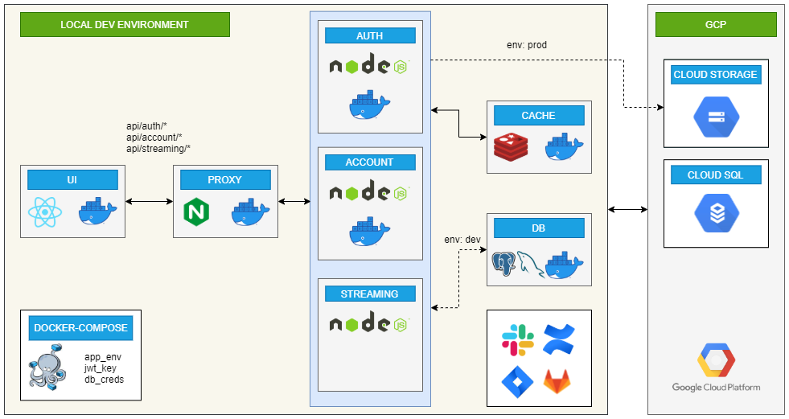
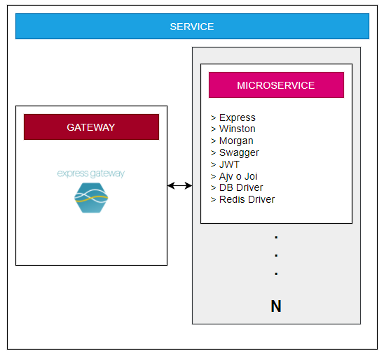

# Proyecto - SoundStream

## Descripción del proyecto
SoundStream es una plataforma de streaming de música, intentando promover el arte Guatemalteco prometiendo una experiencia robusta, confiable y amigable para sus clientes. Es una plataforma completamente en la nube, diseñada para ser utilizada en cualquier navegador Web. En esta plataforma, los clientes podrán crear una cuenta y decidir suscribirse a un plan gratis o pagado. La diferencia entre ambos planes es únicamente la cantidad de canciones que un cliente puede escuchar seguido antes de recibir un anuncio, y la capacidad de retroceder canciones o reproducir playlists personales. La descripción de las funcionalidades que tendrá SoundStream será definida en el enunciado a continuación. 

## FASE 1

### Configuración del flujo de trabajo

Uno de los objetivos principales del proyecto es simular un ambiente laboral en cada grupo de estudiantes, por lo cual se utilizarán diferentes herramientas de comunicación, visibilidad y trabajo. 

#### JIRA

Utilizarán un sitio de [Atlassian](https://www.atlassian.com/es/software/jira) por equipo, en el cual configurarán un workspace de Scrum o de Kanban. 

El tablero en el que trabajarán debe tener al menos las siguientes columnas: 

**1. TO-DO:** Tareas que están pendientes de realizar
**2. Bloqueadas:** Tareas que no pueden seguir ya que falta finalizar otra tarea. 
**3. En proceso:** Tareas que están actualmente siendo realizadas.
**4. En test/QA:** Tareas que están listas para ser verificadas.
**5. Listas para producción:** Tareas que están listas para ser enviadas a producción.
**6. Finalizadas:** Tareas que ya fueron desarrolladas, probadas y están actualmente en producción.

#### SCRUM PRACTICES

Se realizarán diversas prácticas de Scrum, para familiarizar al estudiante con el flujo de trabajo que este tiene. Cada equipo deberá realizar y dejar documentado (grabación utilizando Google Meet) las siguientes prácticas. Cada uno de los enlaces a estas grabaciones debe estar en un documento de [Confluence](https://www.atlassian.com/software/confluence), documentando el día y actividad que se realizó. No es necesario encender las cámaras, pero si es necesario que el equipo completo esté en la mayoría de las actividades. 

**1. Daily Scrum:** Es una reunión corta (10-15 minutos) diaria, cada estudiante debe decir lo que hizo el día anterior para llegar a la meta del sprint, lo que hará el día de hoy para llegar a la meta, y cualquier blocker o problema que haya tenido realizando sus actividades. 
**2. Sprint Planning:** Al inicio del sprint. El grupo se unirá a una sesión (generalmente de 45-60 minutos) en la cual se crearán y discutirán las historias de usuario que se trabajarán en el sprint.
En esta reunión deben realizar [Poker Planning](https://planningpoker.live/join), en el cual decidirán el valor de negocio que representa cada una de las historias que traerán al sprint. 
**3. Backlog Grooming:** A la mitad del sprint. El grupo se unirá en una sesión (generalmente de 30-60 minutos) en la que discutirán las historias que faltan por llevarse a cabo en el sprint, se puede agregar o eliminar historias en este momento, dependiendo del estado actual de los tickets en progreso. 
**4. Sprint Retrospective:** A final del sprint. El grupo se unirá en una sesión corta (generalmente de 15 a 30 minutos) en la cual discutirán del progreso que realizaron en el sprint, de qué maneras pueden mantenerse o mejorar en el siguiente sprint. Es una buena oportunidad para hacer una pequeña actividad en equipo que permita unirse y conocerse más. 

#### SLACK

Utilizarán Slack como su plataforma de comunicación oficial, en cada calificación se deberá tener pruebas de que utilizaron esta plataforma para comunicarse de manera profesional entre el equipo. En este medio deberán dejar documentado que planificaron cada actividad de scrum por medio de un mensaje enviando el link de la reunión de Google Meet y la actividad que realizarán. Ejemplo: 

> Buena tarde compañeros, por favor unirse al Daily Scrum del día de hoy: https://meet.google.com/vhd-hede-haz

#### GIT
Utilizarán git como su sistema de control de versiones. Deberán configurar hooks para asegurar que el código de cada funcionalidad siga con todas las buenas prácticas que como equipo definirán. 

#### GITFLOW
Como marco de trabajo colaborativo de git, utilizarán Gitflow, en el cual tendrán que definir una rama de producción y una de desarrollo, los features acorde a cada ticket (historias de usuario), releases a producción y hotfixes que surjan en el desarrollo del sistema.

#### GITLAB

Configurarán un [grupo de trabajo en Gitlab](https://gitlab.com/dashboard/groups), en el cual agregarán al tutor académico (el usuario es: @3001381800101). En este grupo almacenaran el o los repositorios que utilizarán para realizar su proyecto. 

> Tip: Configuren su cuenta para utilizar SSH para conectarse al repositorio, ya que les ahorrará problemas de seguridad y permisos en la segunda y tercera fase del proyecto. 

## Diagrama general - Primera Fase

En la primera fase del proyecto, nos enfocaremos únicamente en configurar el ambiente local de desarrollo. El objetivo de esta fase respecto al desarrollo es familiarizar al estudiante con Docker, Docker-Compose, el desarrollo de servicios utilizando buenas prácticas y cómo es la configuración de desarrollo inicial de un sistema. 



Se utilizará una arquitectura orientada a servicios, cada uno de estos servicios tendrá una granularidad aumentada implementando microservicios (se explicará más adelante en el enunciado). 

El diagrama general de la primera fase se divide en dos partes:

1. Local Dev Environment: Los integrantes del grupo configurarán sus máquinas, instalarán Docker y crearán los repositorios que crean necesarios para llevar a cabo el desarrollo de la aplicación. 
2. GCP: En esta fase solamente utilizarán dos servicios de la nube provistos por Google Cloud Platform: Cloud Storage y Cloud SQL. 

### Local Dev Environment

#### UI
Para desarrollar la UI utilizarán la biblioteca [ReactJS](https://www.googleadservices.com/pagead/aclk?sa=L&ai=DChcSEwik1M7y4JD4AhUXyZQJHWt4DDEYABABGgJ5bQ&ae=2&ohost=www.google.com&cid=CAESaeD2jIlBIxTlxW0whJA9LfnhoRkp9VV0lAHzJG4xE3uJx5RkPvOUukzMi8CistYmFs2ihvt-O5N8bMrKwXtr207ExkuHUjoFgMkNjdYaR9Ox2gzspNwM4YR1kYvo2EWsMvSYhuBZ8lbXjA&sig=AOD64_1A84KBhjznDtvOG9Vmg8gttoEV2w&q&adurl&ved=2ahUKEwjR08fy4JD4AhWxSzABHUWRDnoQ0Qx6BAgFEAE), opcionalmente pueden utilizar [NextJS](https://nextjs.org/learn/basics/create-nextjs-app). 

La UI es encargada de presentar al cliente todas las funcionalidades del sistema, siempre de manera segura y con una buena experiencia de usuario. 

Para esta fase, se requieren únicamente las siguientes funcionalidades:

1. Reproducir una playlist por defecto, la cual se llamará _SSRadio_. En esta, se reproducirá de manera aleatoria las canciones que se tengan almacenadas en Cloud Storage. La interfaz de este reproductor de música debe tener las funcionalidades básicas (reproducir, pausar, siguiente, anterior). 
2. Explorar y reproducir las canciones o álbumes que se encuentran actualmente en el sistema. 

Las funcionalidades de autenticación y aspectos relacionados al usuario serán desarrolladas en las siguientes fases del proyecto. Los datos mínimos a almacenar y mostrar se detallarán más adelante en el enunciado. 

La interfaz queda a discreción del estudiante, sin embargo se tomará en cuenta en la calificación la experiencia de usuario y usabilidad de la misma. 

Para efectos prácticos, pueden tomar los aspectos básicos de la interfaz de Spotify, SoundCloud o YouTube.

Pueden utilizar componentes ya creados, templates y cualquier Design System que deseen. **Tomar en cuenta que en la calificación se harán preguntas directas del código que realizaron.**

Lista de referencias que podrían ser útiles para el desarrollo de la interfaz: 
* https://www.npmjs.com/package/react-soundplayer
* https://bestofreactjs.com/repo/soundblogs-react-soundplayer-react-audio-video
* https://labs.voronianski.dev/react-soundplayer/
* https://codespots.com/library/item/3553

#### REVERSE PROXY

Ya que tenemos varios servicios en el lado de nuestra lógica del sistema (backend), necesitamos una herramienta que una todas las rutas a las que realizaremos las peticiones en un mismo endpoint. La función de NGINX en este caso es el de un reverse proxy, que permite tener un único endpoint que utilizará el cliente, y múltiples endpoints de los servicios que se desarrollarán.

- https://docs.nginx.com/nginx/admin-guide/web-server/reverse-proxy/
- https://www.atlantic.net/dedicated-server-hosting/how-to-deploy-nginx-reverse-proxy-in-docker-on-ubuntu-20-04/
- https://adamtheautomator.com/nginx-reverse-proxy-docker/
- https://phoenixnap.com/kb/docker-nginx-reverse-proxy

#### BACKEND - SERVICIOS

Para esta fase utilizaremos tres servicios principales: Auth, Account y Streaming. 

Cada uno de los servicios acá detallados tienen que estar divididos en **al menos dos microservicios**, la división de estos queda a discreción del equipo. 

El diagrama de un servicio es el siguiente:



El servicio se compone de un gateway, que será el encargado de redireccionar las peticiones al microservicio correspondiente. Pueden utilizar express-gateway o cualquier otra herramienta que permita esta funcionalidad.

https://www.express-gateway.io/getting-started/

Cada microservicio debe utilizar las siguientes herramientas:

**1. Express:** Utilizar express para crear una API en nodejs. https://www.tutorialspoint.com/expressjs/index.htm
**2. Winston:** Herramienta para realizar logging de acciones. Cada una de las acciones *importantes* y errores que ocurran en la API debe tener una bitácora. https://www.section.io/engineering-education/logging-with-winston/
**3. Morgan:** Herramienta para realizar logging de las peticiones que llegan a la API. https://www.digitalocean.com/community/tutorials/nodejs-getting-started-morgan
**4. Swagger:** Herramienta para crear documentación de la API. https://blog.logrocket.com/documenting-your-express-api-with-swagger/
**5. JWT:** Herramienta para implementar autenticación y seguridad a las peticiones. https://www.digitalocean.com/community/tutorials/nodejs-jwt-expressjs
**6. AJV o JOI:** Herramienta para implementar validaciones a los datos que se envían en las peticiones. https://learnetto.com/tutorials/integrating-ajv-into-your-express-application
**7. DB Driver:** Dependiente del motor de base de datos que utilicen. Se recomienda utilizar Sequelize, aunque existen otras opciones ligeras y rápidas de implementar. https://www.bezkoder.com/node-js-express-sequelize-mysql/ Cualquier cliente para MySQL o PostgreSQL es válido.
**8. Redis Driver:** Utilizarán este cliente de Redis para comunicarse con su cache. Donde implementar cache será a criterio del equipo, **pero al menos debe ser utilizado en 2 peticiones.**


#### Auth
Este servicio manejará toda la funcionalidad de la autenticación y manejo de la sesión del usuario. Para ello, utilizarán JWT como método de autenticación del usuario. 

Para esta fase, se requiere de las siguientes funcionalidades: 

1. Registrarse: los datos de contraseña y tarjeta deben ser encriptados y almacenados de forma segura. https://levelup.gitconnected.com/encryption-made-simple-with-cryptojs-3628f5867d78. No es necesario tener una tarjeta para registrarse. La suscripción por defecto de un usuario es "Básica".
2. Iniciar sesión

> No se debe implementar estas funcionalidades en la interfaz gráfica.

#### Account
Este servicio manejará todas las funcionalidades directas con la cuenta de cada cliente. La suscripción en la que está, los datos de su perfil, los datos de sus playlists, etc. 

Para esta fase, se requieren las siguientes funcionalidades: 
1. CRUD los datos de perfil de usuario.
2. Seleccionar una suscripción. Para seleccionar una suscripción premium, es necesario enviar los datos de una tarjeta para realizar el cobro. Esta información debe ser transportada de manera encriptada. https://levelup.gitconnected.com/encryption-made-simple-with-cryptojs-3628f5867d78. Junto con la información de la tarjeta, se debe enviar la cantidad de "saldo" que tiene la misma. Y debitar el precio de la suscripción premium (definido por el equipo). Si no hay saldo suficiente la petición debe resultar en un error. El tiempo de una suscripción es de 1 mes, luego de ese tiempo, la suscripción deja de ser válida y debe auto-renovarse.
3. Darse de baja de una suscripción. 

> No se debe implementar estas funcionalidades en la interfaz gráfica

#### Streaming
Este servicio se encargará de todas las funcionalidades de streaming y reproducción. También puede encargarse de rellenar la información que tiene el sistema. 

Para esta fase, se requieren las siguientes funcionalidades: 
1. CRUD canciones: una canción tiene una referencia a un archivo en Cloud Storage, y metadatos como su título, artista, álbum (opcional), etc. 
2. CRUD álbumes: un álbum es una colección de canciones.

> Los usuarios no pueden crear, eliminar o modificar canciones ni álbumes. Pueden realizar estas acciones desde Postman o cualquier herramienta que utilicen para probar su servicio. **Esta será la única excepción de funcionalidad que se calificará con esas herramientas.**

### Bases de datos

#### Datos mínimos a almacenar
A continuación se listan los datos mínimos con los que debe trabajar el sistema, queda a discreción del equipo cualquier otro dato que consideren necesario agregar. 
##### Cliente
```javascript
const client = {
    name: 'Leo Aguilar',
    email: 'leo@gmail.com',
    password: '*******', // Recordar que este dato debe estar encriptado
    card: {
        number: 'XXXX-XXXX-XXXX-1234', //se debe mostrar este formato al usuario, pero el valor debe estar encriptado en la BD.
        cvv: '123', // este valor también debe estar encriptado
        exp_date: "01/2025",
        balance: 300 // este valor es asignado aleatoriamente cuando se crea el usuario, solamente para tener una manera de simular el cobro de la suscripción premium
    },
    gravatar: 'http://...', // profile pic a mostrar en la interfaz, obtenida desde el correo del usuario, pueden consultar 
}
```

##### Cancion
```javascript
const song = {
    id: 1234,
    name: 'Marooned',
    artist: 'Pink Floyd',
    album: {
        name: 'The Division Bell',
        artist: 'Pink Floyd',
        id: 4,
        // link a los blobs de Cloud Storage
        cover_image: 'gcloud.storage.com/file/divisonbell.jpg'
    },
    // links a los blobs de Cloud Storage
    file: 'gcloud.storage.com/file/marooned.mp3',
    cover_image: 'gcloud.storage.com/file/marooned.jpg'
}
```

##### Playlist
```javascript
const playlist = {
    id: 1234,
    user: 'leo@gmail.com',
    name: 'Mis cancioncitas',
    songs: [
        id: 1234,
        ...
    ]
}
```

https://medium.com/@rrojowiec/gravatar-in-your-node-js-application-6aded410e883

#### Redis
Utilizarán Redis como una base de datos en memoria para manejar el caché de su aplicación.
- https://adostes.medium.com/adding-a-redis-cache-to-an-express-app-455c834becd1
- https://developer.redis.com/develop/node/nodecrashcourse/caching

#### DB MySQL / PostgreSQL
La base de datos que utilizarán queda a discreción del equipo. Tendrán una base de datos local, la cual utilizarán para el ambiente de desarrollo de la app. También tendrán una base de datos en Cloud SQL, que utilizarán para su ambiente de producción.

### GCP
#### Cloud Storage
Utilizarán Cloud Storage para almacenar los archivos de música (MP3, Wav, Flac). El tipo de archivo que utilizarán queda a discreción del equipo. La manera en la que interactuarán con Cloud Storage queda discreción del equipo: puede hacer uso de GSUtils, o del sdk.

https://www.youtube.com/watch?v=M_urADGk9BQ
https://cloud.google.com/storage/docs/discover-object-storage-gsutil
https://cloud.google.com/appengine/docs/flexible/nodejs/using-cloud-storage
https://www.bezkoder.com/google-cloud-storage-nodejs-upload-file/

#### Cloud SQL
Utilizarán Cloud SQL para la base de datos del ambiente de producción. Pueden utilizar MySQL o PostgreSQL. 

### Docker-Compose
Todos los servicios, el reverse-proxy y la interfaz de usuario deben estar en contenedores de Docker. Cada uno debe tener un Dockerfile asociado y tener sus propios scripts de building. 

Se utilizará Docker-compose para orquestar los contenedores resultantes del sistema, se debe configurar las variables de entorno de cada servicio desde esta herramienta. 

La única variable de entorno obligatoria es **app_env**, que puede tener el valor de ```PROD``` para un ambiente de producción o ```DEV``` para un ambiente de desarrollo. Si el ambiente es de producción, los logs de tipo debug e info deben ser limitados, y se debe utilizar la base de datos de Cloud SQL. Para el ambiente de desarrollo, se debe mostrar la mayor cantidad de logs posibles y se debe utilizar la base de datos local. 

## Configuración de los repositorios
Para esta fase, cada uno de los repositorios que el equipo utilice (es permitido utilizar un único repositorio) debe tener las siguientes herramientas instaladas y configuradas: 

**1. Git:** Utilizarán git como el manejador de versiones del repositorio. Es importante recordar que es obligatorio utilizar **GitFlow**. https://www.atlassian.com/git/tutorials/comparing-workflows/gitflow-workflow
**2. Husky:** Se deben configurar los hooks de pre-commit y pre-push asociados al repositorio. En ambos hooks se ejecutará prettier, eslint y las pruebas unitarias. https://github.com/typicode/husky
**3. Prettier y Eslint:** Se debe configurar prettier y eslint para mantener siempre las buenas prácticas de codificación a través de todos los archivos del repositorio.
- https://www.imaginarycloud.com/blog/how-to-configure-eslint-prettier-in-react/ 
- https://blog.bitsrc.io/how-to-set-up-node-js-application-with-eslint-and-prettier-b1b7994db69f

**4. Jest:** Se utilizará Jest para ejecutar las pruebas unitarias del proyecto. Se debe configurar para que el coverage aceptado sea siempre mayor a 90% para el código y branches. 
- https://www.valentinog.com/blog/jest-coverage/
- https://medium.com/bb-tutorials-and-thoughts/how-to-write-unit-tests-in-nodejs-with-jest-test-library-a201658829c7 

## Documentación
Para esta fase, deben generar la siguiente documentación:
1. Documentación de las actividades de Scrum que realizaron. Debe ser una página de Confluence, donde listen los enlaces a las grabaciones que realizaron de sus meetings. Para cada sprint que realizaron deben adjuntar el ```Burndown Chart``` para demostrar todos los puntos que realizaron en el sprint.
2. Documentación de las páginas que generaron y lo que hacen sus componentes. Puede ser una página de Confluence o un archivo markdown.
3. Diagrama de la arquitectura de sus microservicios y su explicación. Puede ser una página de Confluence o un archivo markdown. 

## Entregables
Toda la documentación, enlaces a páginas de Confluence que crearon, imágenes y demás debe estar en el README de sus repositorios. 

El único entregable debe ser el link o los links a su repositorio en Gitlab.

## Consideraciones

- Utilizar los lenguajes, frameworks y herramientas detalladas en el enunciado.
- Se trabajará en equipos no mayores a 5 personas.
- Copias totales o parciales tendrán una nota de 0 puntos y será reportado a las autoridades correspondientes.
- Deben realizar al menos 2 sprints en cada fase. 
- Se revisará que hayan utilizado Slack para la comunicación de su equipo.
- Se revisará que hayan creado correctamente las historias y tickets en Jira. 
- Se revisará que hayan trabajado correctamente con Git-Flow.
- Todas las dudas se resolverán en el foro correspondiente en UEDi o en el periodo de clase. 

## Fechas de entrega

- PRIMERA FASE: **13 de junio de 2022**
- SEGUNDA FASE: **21 de junio de 2022**
- TERCERA FASE: **30 de junio de 2022**